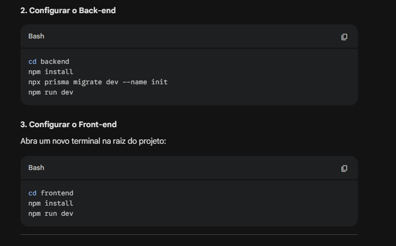

# 💰 Finanças Simples - Full-Stack

Um gerenciador de finanças pessoal moderno com foco em performance e experiência do usuário (UX). Este projeto foi desenvolvido para consolidar conhecimentos em desenvolvimento Full-Stack, utilizando o ecossistema JavaScript de ponta a ponta.

---

## 🚀 Tecnologias

Este projeto foi construído com as seguintes tecnologias:

**Back-end:**
- [Node.js](https://nodejs.org/en/)
- [Express](https://expressjs.com/)
- [Prisma ORM](https://www.prisma.io/) (com SQLite)
- [CORS](https://github.com/expressjs/cors)

**Front-end:**
- [React](https://reactjs.org/)
- [Vite](https://vitejs.dev/)
- [CSS3](https://developer.mozilla.org/en-US/docs/Web/CSS) (Design Moderno/Dark Mode)
- [Lucide React / Phosphor Icons](https://lucide.dev/) (Opcional)

---

## 💻 Projeto

O **Finanças Simples** permite o controle total de entradas e saídas financeiras. A aplicação calcula automaticamente o saldo atual e exibe um resumo visual no topo da tela, seguindo padrões estéticos de aplicações bancárias modernas.

### Principais Funcionalidades:
- **Dashboard de Resumo:** Visualização rápida de Entradas, Saídas e Total.
- **Histórico de Transações:** Listagem dinâmica dos registros salvos no banco de dados.
- **Gestão de Dados:** Adição de novas transações e exclusão com atualização em tempo real (State Management).
- **Design Responsivo:** Interface adaptável para diferentes tamanhos de tela.

---

## 🛠️ Como rodar a aplicação

### Pré-requisitos
Antes de começar, você vai precisar ter instalado em sua máquina o [Node.js](https://nodejs.org/en/).

### 1. Clonar o repositório
```bash
git clone [https://github.com/SEU_USUARIO/financas-fullstack.git](https://github.com/SEU_USUARIO/financas-fullstack.git)
cd financas-fullstack

